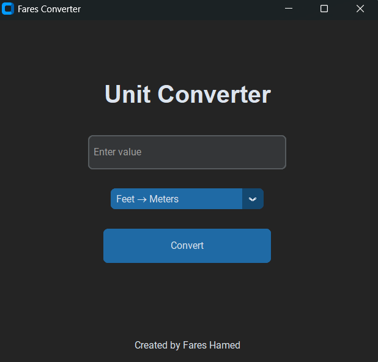

# 🔢 Unit Converter

A simple and clean **Python desktop application** that converts **Feet to Meters** with a modern graphical interface.

---

## ✨ Features

* Modern GUI built with Python
* Fast and accurate conversion
* Simple and user-friendly interface
* Lightweight desktop application

---

## 🖥️ Screenshot



---

## 🚀 How to Run

1. Install Python
2. Run the application

```bash
python app.py
```

Or run the compiled version:

```bash
app.exe
```

---

## 🛠️ Built With

* Python
* CustomTkinter

---

## 👨‍💻 Author

**Fares Hamed**

---

## 📂 Project Structure

```
unit-converter
│
├── app.py
├── profile.png
├── app.spec
└── dist/app.exe
```
